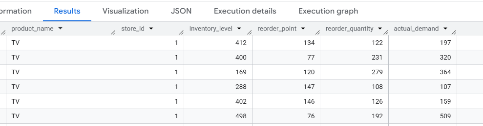
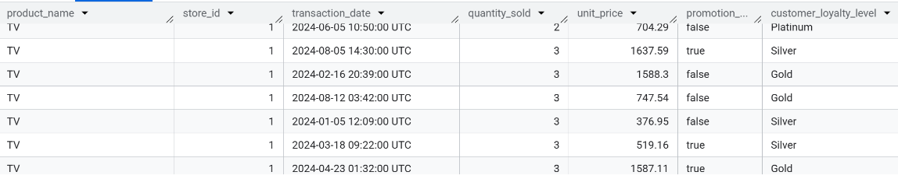
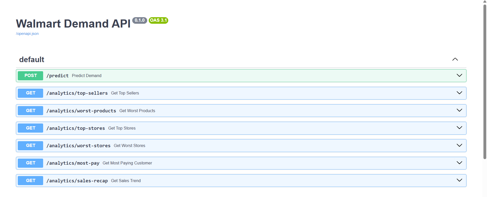

1) **Analysis of Business Performance and Predicting Demand of Product of Supermarket chain Walmart**

💻**Technology used**
- `Python`
- `SQL`
- `Google BigQuery`
- `Jupyter Notebook`
- `FastAPI`
- `Render.com`
- `Scikit-learn`
- `Pandas`


🌐**FastAPI Render Web Service**:

`https://walmart-api-y60v.onrender.com/docs#/` 

You can check out this link to get the data. Note that `predict` is the API endpoint for the machine learning model.

This project will use Google Bigquery for its data warehouse storage. The data warehouse is structured using Star Schema to minimize storage and optimize perfomance for analysis tool, (see `section 3`). After that is the cleaning and data prepping for the machine learning (see `Section 4`). Finally this project run SQL to report on the business perfomance by revenue, profit, top selling product, worst selling store, ... and implement a servers to host API endpoints for those functions (see `section 5`)
1) **Data Profiling & Quality Assessment**
During the profling of the data to find correlations between `reorder_point` and `reorder_quantity`, `inventory_level` and `actual_demand`, the data suggests that there is lack of real world logic about them. The `reorder_point` supposed to suggest the need to restock supply for a specific item in the store, but the observation make no sense, reorder point would sometimes go up when demands and inventory drop, and sometimes go down when demands rises. This suggest the dataset contain synthetic, randomized data. This conclusion is also more concrete when looking at the correlation of unit price of a store given a specific product and customer loyalty point, there seems to be no price logic involving the product, furthermore solidifying the conclusion.

```SQL
    SELECT product_name, category, quantity_sold, transaction_date,
    store_id, inventory_level, reorder_point, reorder_quantity, actual_demand 
    FROM `extended-altar-423112-j9.Walmart.Initial` 
    WHERE product_name = 'TV'
    ORDER BY store_id, transaction_date
```


```SQL
    SELECT product_name, store_id, transaction_date, quantity_sold, unit_price, promotion_applied, customer_loyalty_level
    FROM `extended-altar-423112-j9.Walmart.Initial`
    WHERE product_name = 'TV'
    ORDER BY store_id, quantity_sold
```



3) **Data Warehousing & Dimension Modeling (ELT) (Note that since this is a synthetic randomly generated dataset so this part is a bit long because there are a lot of fixing and logic mapping)**
*Phases:*
  1. `01_create_dim_store.sql`, The synthetic source data contained referential integrity violations, 1 `store_id` would be mapped to multiple cities. I used an aggregation (ANY_VALUE) to force a strict 1-to-1 relationship, ensuring the dimension table's primary key remained unique.
  2. `02_create_dim_product.sql`, The same case with `dim_store`
  3. `03_create_dim_customer.sql`, The same case with `dim_store`
  4. `04_create_dim_date.sql`, repeating the TIMESTAMP on the fact table would take quite some resources, so i create a surrogate key `date_id` using the format of the date. For example, the date '2024-05-10' would get the id 20240510. Doing so with the format also ensure the order since given the case '2024-04-10' -> the id number = 20240410 would be less than 20240510 (20240410 < 20240510). `transaction_date` TIMESTAMP is group into a full day by the function DATE(transaction_date) so it change the granularity to transactions in a day.  
  5. `05_create_dim_supplier.sql`, The same case with `dim_store`
  6. `06_create_dim_weather.sql`, since repeating the string weather is not ideal, i create a surrogate key `weather_id` using ROW_NUMBER() function with OVER(ORDER_BY weather_conditions) to apply the function over the sorted alphabetically weather_conditions to make sure the id stay consistent because if not sorted then if the data order in the raw dataset change the ids would be changed too so joining with historical data would be mismatched. Using ORDER_BY here ensure that doesn't happen.
  7. `07_create_dim_promotion.sql`, during data observation i saw that the column `promotion_applied` contradict with the column `promotion_type`. The `promotion_type` has the type 'None' and other normal promotion type, and since it is a entirely randomly generated dataset, the promotion applied column would show 'True' for the type = 'None' and 'False' for the normal promotion type. So my conclusion was not only the data of these columns conflict with each other but also the existence of them contradict each other since having a `promtion_type` = 'Percentage Discount' or  = 'None' is already sufficient enough to tell if a promotion is being applied on the transaction, so i decided to leave the `promotion_applied` column out of `dim_promotion`. Then a surrogate key `promotion_id` is created like with the case of `dim_weather`
  8. `08_create_fact_transaction`, no problem here, just need to convert the TIMESTAMP to date_id format (INT64)
  9. `09_create_fact_inventory`, i design it to be a Periodic Snapshot Fact Table. So that for each product from each store in a day, `inventory_level` is captured for them. Since the dataset is highly synthetic and make no real world sense, i try to introduce some logic by taking the smallest `inventory_level` of each day (since it would only make sense if an inventory of a product should be quite low in the end of the day), so that `inventory_level` tells about a inventory level of each product from a store in a day.

4) **Machine Learning Pipeline**
- Used one-hot encoding to transform categorical columns to feed machine learning algorithm
- Transform bool column `is_holiday` to integer 1 and 0
- Feed the prepped data to the `Random Forest Regressor` taking account columns such as `is_holiday`(e.g: sales usually goes up in holiday), `weather_conditions`(e.g: umbrella sales usually goes up in rainy days ), `weekday` (e.g: people usually buy stuff at the weekend), `promotion_type` (e.g: promotion drive price lower, giving that product a better sale)
- Ran Mean Absolute Error, Mean Square Error and R square for evaluation. Given the nature of synthetic dataset, it is no suprised that the precision was bad, so the model perform worse than simply predicting value with mean
- Use joblib to load into pkl file and upload it to drive for downloading

5) **API Endpoint Setup**
- Use render to host a server
- Use FastAPI to create API endpoints, and load the machine learning model, ran SQL to report data such as best/worst selling product and top/worst store based on their total sales, most paying customer based on his/her spending. Finally sales data (revenue, profit, cost, gross margin) depending on user input date. 
- Use render to host a web service
